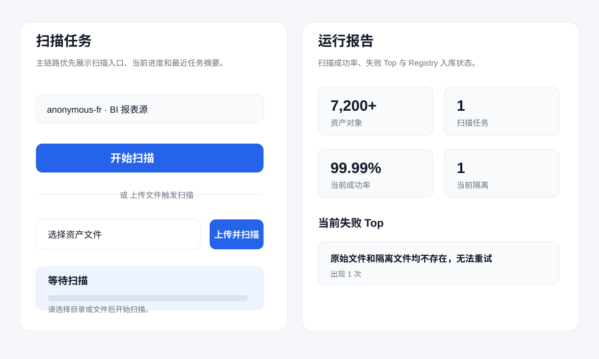
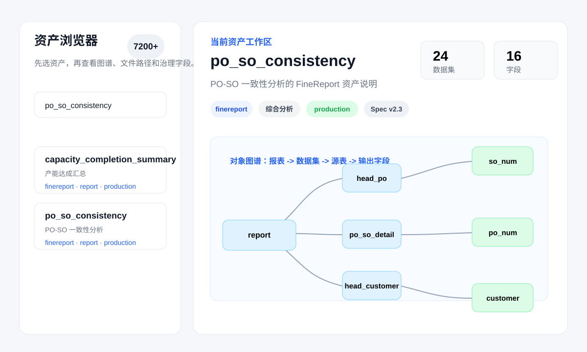
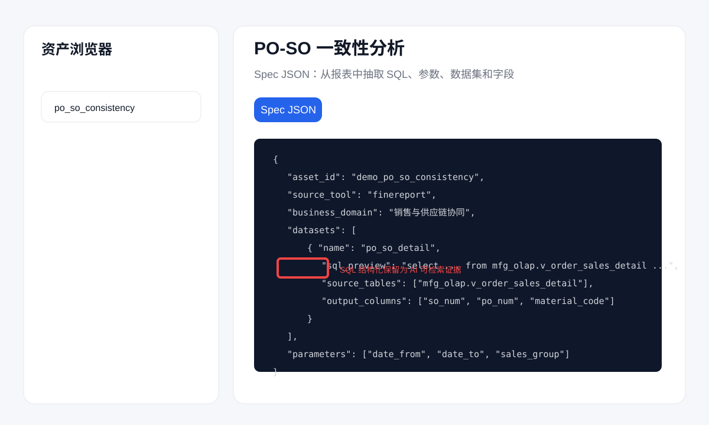
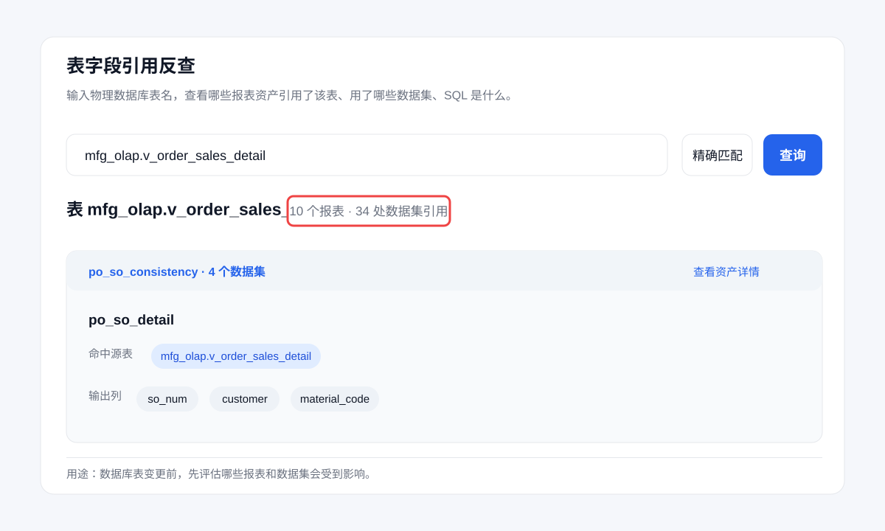
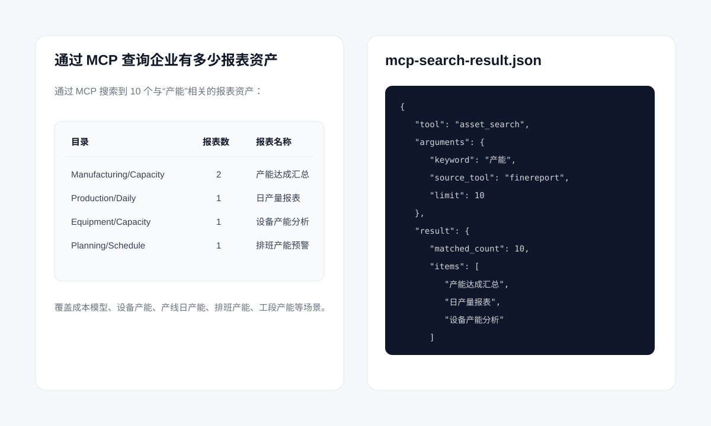

# AI-Ready Report Assets Demo

这个仓库展示一个面向制造业 BI 场景的 **报表资产解析与治理 Demo**。

很多企业已经沉淀了大量 FineReport / BI 报表，但在做 AI 问数时，AI 往往不知道这些报表在哪里、口径是什么、SQL 取了哪些表、字段改动会影响哪些报表。本 Demo 展示一种轻量方法：先把历史报表解析成可检索、可追溯、可被 MCP/Agent 使用的结构化资产，再让 AI 基于证据回答问题。

> 本仓库仅用于技术交流与演示，不包含生产解析器源码，不包含客户真实数据，不提供可直接商用的完整系统。

## Demo 场景

样例来自一个匿名化的消费电子精密制造场景。企业内部通常会有订单、销售预测、PO-SO 一致性、采购交付、物料齐套、生产进度、良率、产能、设备、库存和物流等大量报表。

典型问题包括：

- 这个报表的数据口径是什么？
- 这个字段取了哪些表？
- 为什么系统报表和手工登记的数据对不上？
- 如果改一张数据库表，会影响哪些其他报表？
- AI 问“生产进度为什么停住了”时，应该先查哪些资产？

## 仓库内容

```text
docs/
  methodology.md              # 方法说明
  data-desensitization.md     # 脱敏规则
  faq.md                      # 常见问题
examples/
  manufacturing-bi-report-sample.md
  sample-report-metadata.json
outputs/
  generated-asset-summary.json
  generated-spec-sample.json
  mcp-search-result.json
screenshots/
  01-scan-overview.svg
  02-asset-browser.svg
  03-spec-json.svg
  04-table-impact-analysis.svg
  05-mcp-query-result.svg
media/
  demo-walkthrough-storyboard.md
CONTACT.md
SECURITY.md
NOTICE
```

## 能看到什么

### 1. 报表资产扫描概览



### 2. 资产浏览与对象图谱



### 3. 报表 Spec JSON



### 4. 表引用与影响分析



### 5. MCP 查询结果



## 样例产物

- [生成的资产摘要](outputs/generated-asset-summary.json)
- [生成的 Spec 样例](outputs/generated-spec-sample.json)
- [MCP 查询结果样例](outputs/mcp-search-result.json)

这些 JSON 只保留结构和字段含义，表名、字段名、目录、业务对象、客户标识均已替换为通用制造业样例。

## 方法概览

报表资产解析与治理的目标不是替代 BI 平台，而是把 BI 平台里沉淀的报表知识转换成 AI 可使用的资产上下文。

```text
BI 报表文件 / 平台目录
  -> 受控读取
  -> 报表结构解析
  -> 数据集 / SQL / 参数 / 字段 / 组件抽取
  -> 资产摘要与 Spec 生成
  -> 表字段引用反查
  -> MCP / Agent 查询
```

AI 不直接猜答案，而是先检索资产、确认口径、定位来源，再基于证据组织回答。

## 不包含什么

本仓库不会公开：

- 生产解析器源码
- 真实客户报表文件
- 真实数据库表名、字段名和 SQL 全文
- 客户名称、Logo、域名、人员姓名和访问地址
- 私钥、Token、MCP 真实 endpoint 或服务器信息
- 可直接复刻生产系统的完整工程链路

## 适合交流的场景

如果你所在企业有大量历史 BI 报表，正在做 AI 问数、指标治理、报表迁移或数据资产盘点，可以参考这个 Demo 判断是否存在类似问题：

- 报表很多，但不知道谁在用、取了哪些表；
- 字段或表结构要改，但影响范围难判断；
- 业务口径散落在 SQL、报表文件和少数人经验里；
- AI 问数回答看起来像，但没有可追溯证据；
- 希望让企业 AI 助手 / Copilot / Agent 先查资产，再回答问题。

联系方式见 [CONTACT.md](CONTACT.md)。
